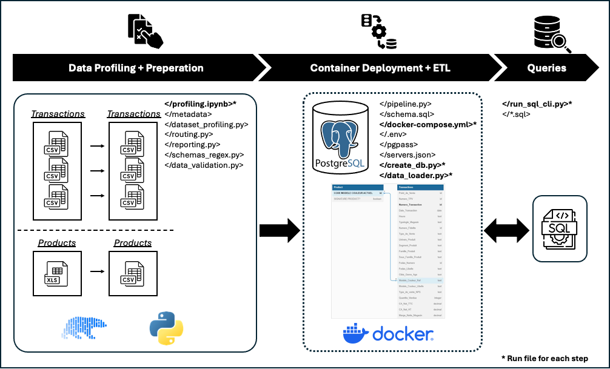

# Data Engineering Junior Coding Challenge

This repository contains the code for the Data Engineering Junior Coding Challenge. The challenge involves working with a dataset of transactions and products, and involves performing various data engineering tasks on roughly 18 million samples.

You can find the result in [SQL Query Results](#sql-query-results).

To get started, please follow the instructions below at [Getting Started](#getting-started). Send me a request if you want to get the dataset for the challenge.


<center>

</center>

The project is based on Python and utilizes libraries such as Polars, PyArrow, FastExcel, Pydantic, SQLAlchemy, and Psycopg2-Binary for data processing and validation. Jupyter Notebooks are used for exploratory data analysis and dataset preprocessing. PostgreSQL is used as the database management system, and Docker is employed for containerization.

The upside of using Polars over Pandas is that it is faster and more memory efficient, especially for larger datasets. Polars is designed to handle larger-than-memory datasets and can perform operations in parallel, making it a better choice for data engineering tasks. It is also easy to install locally, which is why it was chosen for this challenge.


<center>

</center>

## Project Structure

The project is organized into the following main directories:

- `src/`: Contains the source code for the data processing and validation.
- `notebooks/`: Contains Jupyter notebooks for exploratory data analysis and dataset preprocessing.
- `pgadmin/`: Contains configuration files for pgAdmin, a web-based database management tool.

## Project File Tree

```
data-engineering-challenge/
├── src/
│   ├── assets/
│   │   ├── analysis/...
│   │   ├── dataset/
│   │   │   ├── raw/
│   │   │   │   ├── products/...          <--- place raw product (.xlsx) files here
│   │   │   │   └── transactions/...      <--- place raw transaction (.csv) files here
│   │   │   └── processed/
│   │   │       ├── products/...
│   │   │       └── transactions/...
│   │   ├── images/...
│   │   └── metadata/...
│   ├── db/...
│   │   └── sql/...
│   ├── etl/
│   │   ├── ingest/...
│   │   │   ├── create_db.py
│   │   │   ├── data_loader.py
│   │   │   ├── run_sql_cli.py
│   │   │   └── ...
│   │   └── tables/...
│   ├── sql/
│   │   └── queries/...
│   └── utils/...
├── notebooks/
│   └── profiling.ipynb
├── pgadmin/
│   └── ...
├── .env
├── .gitignore
├── docker-compose.yml
├── README.md
└── requirements.txt
```

## Prerequisites
- Python 3.12
- Jupyter Notebook (or JupyterLab)
- Anaconda or Miniconda (for managing virtual environments)
- Docker
- PostgreSQL (via Docker)

## Dependencies

- pandas
- polars
- pyarrow
- fastexcel
- pydantic
- SQLAlchemy
- psycopg2-binary
- notebook
- ipykernel
- jupyterlab
- python-dotenv
- matplotlib
- python-dotenv 


## Getting Started

1. **Clone the Repository**: Start by cloning this repository to your local machine.

    ```bash
    git clone <repository-url>
    cd <repository-directory>
    ```

    ```bash
    # Create a virtual environment
    conda create -n data-engineering-challenge python=3.12
    conda activate data-engineering-challenge

    # Install the required dependencies
    pip install -r requirements.txt
    ```

2. **Start Docker**: Ensure Docker is running on your machine.

3. **Set Up PostgreSQL**: Use Docker to set up a PostgreSQL database. You can use the following command to run a PostgreSQL container:

    ```bash
    docker compose up -d
    ```

4. **Removing Docker again**: To stop and remove the PostgreSQL container, use the following command:

    ```bash
    docker compose down
    ```

## Running the Code

Most heavy lifting is done in the `src/` directory. To completely rerun the data processing pipeline, follow the steps below in your terminal from the `project root directory`:

0. **Download and Place the Data**: 
    
    Download the dataset from the provided link and place the files in the `src/assets/dataset/raw/transactions/` and `src/assets/dataset/raw/products/` directories respectively.

1. **Activate the Virtual Environment**: Ensure your virtual environment is activated.

    ```bash
    conda activate data-engineering-challenge
    ```

2. **Run the profiling and preprocessing**: Run the profiling and preprocessing via `profiling.ipynb` to prepare the data for ingestion.

    ```bash
    code notebooks/profiling.ipynb
    ```

    Then run all the cells inside the notebook.

3. **Ingest the Data**: Run the ingestion script to setup the DB schema in PostgreSQL.

    ```bash
    python -m src.etl.ingest.create_db
    ```

4. **Load the Data**: Run the data loading script to process and load the data into the database. Be aware that this step may take some time to complete (around 20-30 minutes minimum).
    ```bash
    python -m src.etl.ingest.data_loader
    ```

5. **Query the Data**: You can use the provided scripts to query the data and perform various analyses.

    List available predefined SQL queries:
    ```bash
    python -m src.etl.ingest.run_sql_cli --list
    ```

    Run a specific predefined SQL query (replace `<QUERY_FILE_NAME>` with the actual file name):
    ```bash
    python -m src.etl.ingest.run_sql_cli --name <QUERY_FILE_NAME>
    ```

6. **Running new queries**: You can also run your own SQL queries by providing a path to a `.sql` file or by dropping it into the `sql/queries` directory and using the `--name` flag.:
    ```bash
    python -m src.etl.ingest.run_sql_cli --path <PATH_TO_YOUR_SQL_FILE>
    ```
    or
    ```bash
    python -m src.etl.ingest.run_sql_cli --name <YOUR_SQL_FILE_NAME>
    ```

## Assumptions & Notes:

### Notes
- The data processing pipeline is designed to handle large datasets efficiently using Polars and PostgreSQL.
- The SQL queries provided in the `sql/queries` directory are examples and can be modified or extended as needed.
- Ensure that the PostgreSQL container is running before executing any scripts that interact with the database.
- The data loading process may take some time due to the size of the dataset
- Columns such as `Numero_TPV` are missing in some files and are therefore considered optional.
- The field `Numero_Transaction` is not unique and can be repeated across different stores (`Point_de_Vente`).

### Assumptions
- Transactions data is not unique per row. There are duplicates in the data (in 76 cases when filtering across non-missing attributes only). -->  Need to add a surrogate key as primary key to the transactions table.

## SQL Query Results:

1. **The total margin (Marge_Net_Magazin) generated by signature products (Signature_Product?=True) over the last two months.**

    !Assumption that Marge_Net_Magazin is total margin for the transaction and we do not need to multiply it with quantity (Quantite_Vendue).!

    !Assumption that the last two months are relative to the latest date in the dataset.!

    !Assumption that we count months not by days (60 days) but by calendar months.!

    ```sql
    WITH anchor AS (
    -- First day of the latest month that exists in transactions
    SELECT date_trunc('month', MAX(date_transaction))::date AS anchor_month
    FROM transactions
    ),
    month_window AS (
      -- Two-month window: previous month (inclusive) through end of anchor month
      SELECT
        (anchor_month - INTERVAL '1 month')::date AS start_date,        -- start of prior month
        (anchor_month + INTERVAL '1 month')::date AS end_exclusive      -- start of month after anchor
      FROM anchor
    )
    SELECT
      SUM(t.marge_nette_magasin) AS total_margin_last_2_months
    FROM transactions t
    JOIN product p
      ON p.code_modele_couleur_actuel = t.modele_couleur_ref
    JOIN month_window w ON TRUE
    WHERE p.signature_product = TRUE
      AND t.date_transaction >= w.start_date
      AND t.date_transaction <  w.end_exclusive;
    ```
    **Result:**

    

    **Value:**
    (49,264,014.26€ ~ 49.26€ million)

2. **Revenue (CA_NET_TTC) split per day**   
    !Assumption that the revenue is total and we don't need to multiply with quantity (Quantite_Vendue).!

    ```sql
    SELECT
      t.date_transaction AS date,
      SUM(t.ca_net_ttc) AS total_revenue
    FROM transactions t
    GROUP BY t.date_transaction
    ORDER BY t.date_transaction;
    ```
    
    **Result:**
    
    

3. **The top 10 products (Modele_Couleur_Ref) in terms of units sold (Quantite_Vendue).**

    ```sql
    SELECT
      t.modele_couleur_ref,
      SUM(t.quantite_vendue) AS total_units_sold
    FROM transactions t
    GROUP BY t.modele_couleur_ref
    ORDER BY total_units_sold DESC
    LIMIT 10;
    ```

    **Result:**

    

4. **Number of transactions (Numero_Transaction) per store (Point_de_Vente).**

    ```sql
    SELECT
      t.point_de_vente,
      COUNT(DISTINCT t.numero_transaction) AS number_distinct_of_transactions,
      COUNT(t.numero_transaction) AS number_of_transactions
    FROM transactions t
    GROUP BY t.point_de_vente
    ORDER BY number_of_transactions DESC;
    ```

    **Result:**

    
